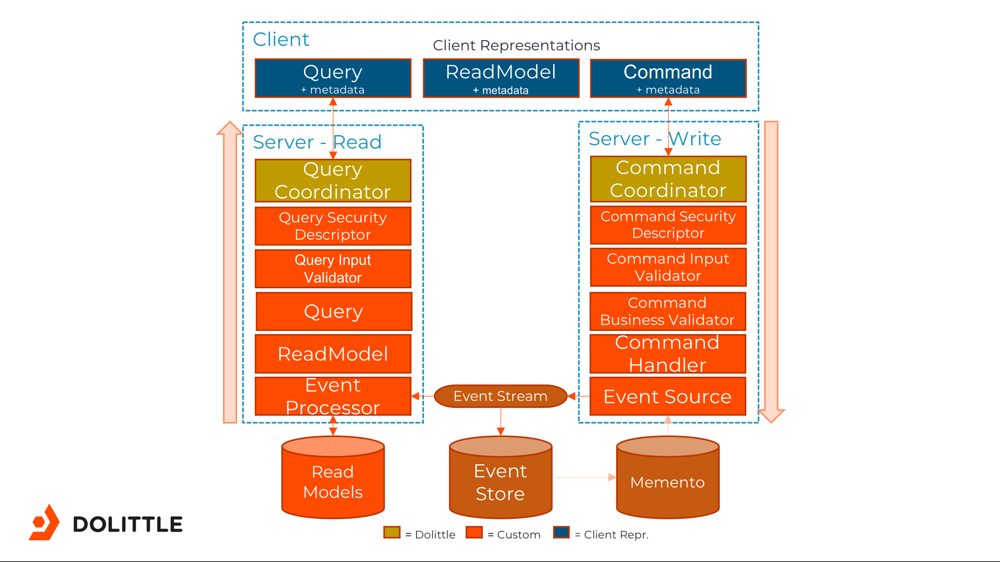
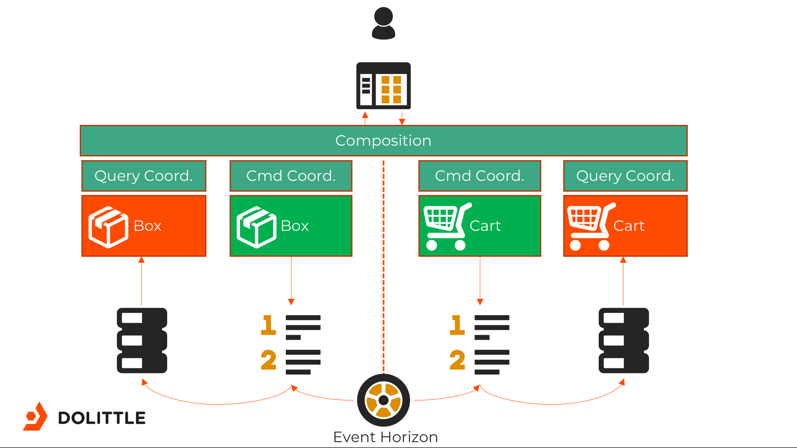

# eCommerce

## Cloning

This repository has sub modules, clone it with:

```shell
$ git clone --recursive <repository url>
```

If you've already cloned it, you can get the submodules by doing the following:

```shell
$ git submodule update --init --recursive
```

## Pre-requisites

In order for this sample to work you are going to need [.NET Core 2.1](https://www.microsoft.com/net/download) and [NodeJS](https://nodejs.org/en/) installed.

## Getting started

The sample is configured to run against a [MongoDB](https://www.mongodb.com) instance running locally, it is assuming a non-secured
instance for this. Its also assuming the default port of `27017` to connect to.

To run MongoDB as a docker image, just do:

```shell
$ docker run -p 27017:27017 mongo
```

This will give you a stateless MongoDB instance - meaning that it won't keep state around between restarts.
You can of course mount a volume for state. Read more on [MongoDBs official Docker image](https://hub.docker.com/_/mongo/).

If you're running Windows, you can also run MongoDB using [Chocolatey](https://chocolatey.org).

```shell
c:\> choco install mongodb
```

To run MongoDB on Windows after installing it with `Chocolatey` you need to create a data directory, the default is `c:\data\db`.
Once this is done you can simply run the MongoDB daemon, which should be located in `c:\Program Files\MongoDB\Server\X.X\bin\mongod.exe`,
where X.X is the version e.g. **3.6**.

Once the database server is running you can use tools like [MongoDB Compass](https://www.mongodb.com/products/compass) or [Studio 3T](https://studio3t.com)
to connect to the server and verify everything is running.

Read more about the package [here](https://chocolatey.org/packages/mongodb).

### Node Packages

The Web solution is built on top of NodeJS tooling and requires all the packages to be installed. For every bounded context with a Web frontend,
you'll find a `Web` folder - this needs to have the packages in place in order to build.

For every bounded context, simply go and do the following:

```shell
$ npm install
```
if you're experiencing trouble with npm install try using yarn instead.

...or if you have [Yarn](https://www.npmjs.com/package/yarn) installed, you can simply do:

```shell
$ yarn
```

Or use the convenience script for doing it:

### Linux / macOS

```shell
$ ./install.sh
```

### Windows

```shell
c:\> install.cmd
```

This should then install all the packages and run `dotnet restore` for the projects as well.

There are multiple bounded contexts, as described later, that can be both run individually or together.
By default, both bounded contexts are configured to assume that the other is running.

To run a bounded context for development purposes with a watcher, you can simply run the `run.js` script in
each bounded contexts `Web` folder. This will build and start the solution and watch for any changes and
rebuild when files change.

To just get started running them, run the script in the root of this repository to get started.

### Linux / macOS

```shell
$ ./run.sh
```

### Windows

```shell
c:\> run.cmd
```

This will run the bounded contexts as background executables. You can easily run them individually as foreground
tasks as well, for each bounded context in seperate terminal windows:

```shell
$ cd Source/{bounded context}/Core
$ dotnet run
```

### Killing the processes
You might need to kill the running processes at some point. In that case we have a kill_all_dot_net.sh script that kill all running dotnet processes.

## Visual Studio 2017

You have to configure the Core project as the startup project

## .dolittle Folder

There is a folder inside each `Core` folder called `.dolittle`. The purpose of this is to hold Dolittle configuration
in one place. In it you'll find the following files with the following purpose:

| File | Purpose |
| ---- | ------- |
| artifacts.json | When you're building, unique representations - non CLR type specific - are discovered and put in this file. Do not delete this file, as this is how Dolittle keeps track of unique types. |
| event-horizons.json | Describes which other event horizons this singularity (bounded context) it's going to connect to, if any. |
| resources.json | This is where we provide the actual configuration of the Read models and the Event store connections for the given tenants. |
| server.json | Dolittle runtime exposes an **interaction** endpoint and a **management** endpoint, these are defined here. Without this file, it will use default settings. |
| tenant-map.json | A single json file called tenant-map.json is used to configure the Tenant Resolving System. |
| tenants.json | A configuration setup with the tenants that you provide resource configurations for. When creating a bounded context through the [dolittle cli tool](https://dolittle.io/cli/) |
| topology.json | Describes the meta-model of the bounded context. Its features and modules is defined here, and the artifacts defined in the artifacts.json file is hooked up to the feature ids that are present here in the topology configuration |
The files themselves are either fully generated or partly generated. The thing they have in common is that they represent metadata of the bounded context for it to be able to run. Things like event horizon and server settings are things that you typically want to take more control over before putting it into a runtime environment and not something governed in source. You might have build tasks that deals with this properly, or a runtime environment that enables you to pre-configure things - like a init container on Kubernetes or similar.
In the Dolittle Cloud offering, this is dealt with.

Navigate to the [dolittle documentation page](https://dolittle.io/overview/) for further details

### event-horizons.json

One of the files in the `.dolittle` folder is one called `event-horizons.json`.
The event horizon system will by default connect them together and be relentless about getting a connection.
If you want to work purely on one bounded context at a time, you can either edit the file and remove any
event horizon to connect to.

For instance, take this:

```json
{
    "eventHorizons": [
        {
            "application": "0d577eb8-a70b-4e38-aca8-f85b3166bdc2",
            "boundedContext": "915b1a57-7eca-4e64-88b4-6329accd86a0",
            "url": "localhost:50054",
            "events": []
        }
    ]
}
```

And remove any content of the `eventHorizons` array:

```json
{
    "eventHorizons": [
    ]
}
```

Alternatively, you can just rename the `event-horizons.json` file or just delete it. This file is typically a file
that should be generated before runtime based on metadata.

## What is it built up of?

Every C# project in the solution is referencing the `Dolittle.SDK` package in the `.csproj` file:

```xml
<PackageReference Include="Dolittle.SDK" Version="2.0.0-alpha2*" />
```

This will give you the API surface needed to develop, such as `Commands`, `Events`, `CommandInputValidator`, `AggregateRoot`
and more.

Every bounded context has the same basic structure in the form of isolated projects with specific purposes, these are:

| Project | Description |
| ------- | ----------- |
| Core | Contains the actual runnable core of a dolittle-based bounded context. It acts as the glue that holds the backend of the bounded context.  |
| Concepts | Contains everything related to domain concepts, typically encapsulated value types and actual value objects |
| Domain | Contains the representation of commands, validation, business rules and aggregate roots / event sources |
| Events | Contains all the events in a bounded context |
| Events.OtherBoundedContext | Contains all the events from other bounded contexts that we want to listen for |
| Read | Contains all the read models, queries and any event processors |
| Web | Contains the web interaction logic of the bounded context, the front end. We default this to Aurelia, but we're framework agnostic |

## Structure

```
+-- Bounded Context 1
|   +-- Module 1
|   +---- Feature 1
|   |     | View.html
|   |     | ViewModel.js
|   |     | Styles.css
|   |     | SomeRestAPI.cs
|   |     | SomeSignalRHub.cs
|   +---- Feature 2
|   |     | View.html
|   |     | ViewModel.js
|   |     | Styles.css
|   |     | SomeRestAPI.cs
|   |     | SomeSignalRHub.cs
+-- Bounded Context 2
...
```


## Application

This application is a very simple sample eCommerce solution. Its purpose is to drive out how you can leverage Dolittle to build
applications, showcasing all aspects of the frameworks and the platform as a whole. An important aspect is to give an insight into
what the different building blocks are, and how they work.

### Bounded Context: Shop

### Bounded Context: Warehouse

## Architecture



### Event Horizon


